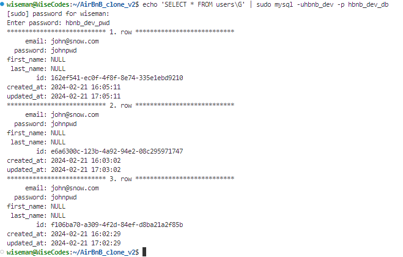
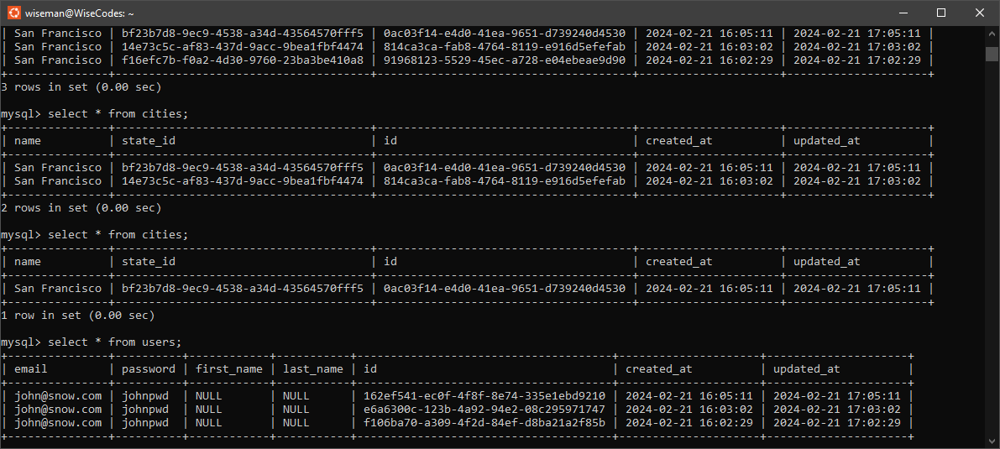

<center> <h1>HBNB - The Console</h1> </center>

This repository contains the initial stage of a student project to build a clone of the AirBnB website. This stage implements a backend interface, or console, to manage program data. Console commands allow the user to create, update, and destroy objects, as well as manage file storage. Using a system of JSON serialization/deserialization, storage is persistent between sessions.

---

<center><h3>Repository Contents by Project Task</h3> </center>

| Tasks | Files | Description |
| ----- | ----- | ------ |
| 0: Authors/README File | [AUTHORS](https://github.com/wiseman-umanah/AirBnB_clone_v2/blob/master/AUTHORS) | Project authors |
| 1: Pep8 | N/A | All code is pep8 compliant|
| 2: Unit Testing | [/tests](https://github.com/wiseman-umanah/AirBnB_clone_v2/tree/master/tests) | All class-defining modules are unittested |
| 3. Make BaseModel | [/models/base_model.py](https://github.com/wiseman-umanah/AirBnB_clone_v2/blob/master/models/base_model.py) | Defines a parent class to be inherited by all model classes|
| 4. Update BaseModel w/ kwargs | [/models/base_model.py](https://github.com/wiseman-umanah/AirBnB_clone_v2/blob/master/models/base_model.py) | Add functionality to recreate an instance of a class from a dictionary representation|
| 5. Create FileStorage class | [/models/engine/file_storage.py](https://github.com/wiseman-umanah/AirBnB_clone_v2/blob/master/models/engine/file_storage.py) [/models/_ _init_ _.py] | Defines a class to manage persistent file storage system|
| 6. Console 1.1 | [console.py](https://github.com/wiseman-umanah/AirBnB_clone_v2/blob/master/console.py) | Update the console with methods allowing the user to create, destroy, show, and update stored data |
| 7. Create User class | [console.py](https://github.com/wiseman-umanah/AirBnB_clone_v2/blob/master/models/user.py) [/models/engine/file_storage.py]| Dynamically implements a user class |
| 8. More Classes | [/models/](https://github.com/wiseman-umanah/AirBnB_clone_v2/tree/master/models) | Dynamically implements more classes |
| 11. Create DBStorage class | [/models/engine/file_storage.py](https://github.com/wiseman-umanah/AirBnB_clone_v2/blob/master/models/engine/file_storage.py) [/models/_ _init_ _.py] | Defines a class to manage persistent database storage system|storage |
<br>
<br>
<center> <h2>General Use</h2> </center>

1. First clone this repository.
```
git clone https://github.com/wiseman-umanah/AirBnB_clone_v2.git
```

3. Once the repository is cloned locate the "console.py" file and run it as follows:
```
$ ./console.py
```
4. When this command is run the following prompt should appear:
```
(hbnb)
```
5. This prompt designates you are in the "HBnB" console. There are a variety of commands available within the console program.

##### Commands
    * create - Creates an instance based on given class

    * destroy - Destroys an object based on class and UUID

    * show - Shows an object based on class and UUID

    * all - Shows all objects the program has access to, or all objects of a given class

    * update - Updates existing attributes an object based on class name and UUID

    * quit - Exits the program (EOF will as well)


##### Alternative Syntax
Users are able to issue a number of console command using an alternative syntax:

	Usage: <class_name>.<command>([<id>[name_arg value_arg]|[kwargs]])
Advanced syntax is implemented for the following commands: 

    * all - Shows all objects the program has access to, or all objects of a given class

	* count - Return number of object instances by class

    * show - Shows an object based on class and UUID

	* destroy - Destroys an object based on class and UUID

    * update - Updates existing attributes an object based on class name and UUID

<br>
<br>
<center> <h2>Examples</h2> </center>
<h3>Primary Command Syntax</h3>

###### Example 0: Create an object
Usage: create <class_name>
```
(hbnb) create BaseModel
```
```
(hbnb) create BaseModel
3aa5babc-efb6-4041-bfe9-3cc9727588f8
(hbnb)                   
```
###### Example 1: Show an object
Usage: show <class_name> <_id>

```
(hbnb) show BaseModel 3aa5babc-efb6-4041-bfe9-3cc9727588f8
[BaseModel] (3aa5babc-efb6-4041-bfe9-3cc9727588f8) {'id': '3aa5babc-efb6-4041-bfe9-3cc9727588f8', 'created_at': datetime.datetime(2020, 2, 18, 14, 21, 12, 96959), 
'updated_at': datetime.datetime(2020, 2, 18, 14, 21, 12, 96971)}
(hbnb)  
```
###### Example 2: Destroy an object
Usage: destroy <class_name> <_id>
```
(hbnb) destroy BaseModel 3aa5babc-efb6-4041-bfe9-3cc9727588f8
(hbnb) show BaseModel 3aa5babc-efb6-4041-bfe9-3cc9727588f8
** no instance found **
(hbnb)   
```
###### Example 3: Update an object
Usage: update <class_name> <_id>
```
(hbnb) update BaseModel b405fc64-9724-498f-b405-e4071c3d857f first_name "person"
(hbnb) show BaseModel b405fc64-9724-498f-b405-e4071c3d857f
[BaseModel] (b405fc64-9724-498f-b405-e4071c3d857f) {'id': 'b405fc64-9724-498f-b405-e4071c3d857f', 'created_at': datetime.datetime(2020, 2, 18, 14, 33, 45, 729889), 
'updated_at': datetime.datetime(2020, 2, 18, 14, 33, 45, 729907), 'first_name': 'person'}
(hbnb)
```
<h3>Alternative Syntax</h3>

###### Example 0: Show all User objects
Usage: <class_name>.all()
```
(hbnb) User.all()
["[User] (99f45908-1d17-46d1-9dd2-b7571128115b) {'updated_at': datetime.datetime(2020, 2, 19, 21, 47, 34, 92071), 'id': '99f45908-1d17-46d1-9dd2-b7571128115b', 'created_at': datetime.datetime(2020, 2, 19, 21, 47, 34, 92056)}", "[User] (98bea5de-9cb0-4d78-8a9d-c4de03521c30) {'updated_at': datetime.datetime(2020, 2, 19, 21, 47, 29, 134362), 'id': '98bea5de-9cb0-4d78-8a9d-c4de03521c30', 'created_at': datetime.datetime(2020, 2, 19, 21, 47, 29, 134343)}"]
```

###### Example 1: Destroy a User
Usage: <class_name>.destroy(<_id>)
```
(hbnb) User.destroy("99f45908-1d17-46d1-9dd2-b7571128115b")
(hbnb)
(hbnb) User.all()
(hbnb) ["[User] (98bea5de-9cb0-4d78-8a9d-c4de03521c30) {'updated_at': datetime.datetime(2020, 2, 19, 21, 47, 29, 134362), 'id': '98bea5de-9cb0-4d78-8a9d-c4de03521c30', 'created_at': datetime.datetime(2020, 2, 19, 21, 47, 29, 134343)}"]
```
###### Example 2: Update User (by attribute)
Usage: <class_name>.update(<_id>, <attribute_name>, <attribute_value>)
```
(hbnb) User.update("98bea5de-9cb0-4d78-8a9d-c4de03521c30", name "Todd the Toad")
(hbnb)
(hbnb) User.all()
(hbnb) ["[User] (98bea5de-9cb0-4d78-8a9d-c4de03521c30) {'updated_at': datetime.datetime(2020, 2, 19, 21, 47, 29, 134362), 'id': '98bea5de-9cb0-4d78-8a9d-c4de03521c30', 'name': 'Todd the Toad', 'created_at': datetime.datetime(2020, 2, 19, 21, 47, 29, 134343)}"]
```
###### Example 3: Update User (by dictionary)
Usage: <class_name>.update(<_id>, <dictionary>)
```
(hbnb) User.update("98bea5de-9cb0-4d78-8a9d-c4de03521c30", {'name': 'Fred the Frog', 'age': 9})
(hbnb)
(hbnb) User.all()
(hbnb) ["[User] (98bea5de-9cb0-4d78-8a9d-c4de03521c30) {'updated_at': datetime.datetime(2020, 2, 19, 21, 47, 29, 134362), 'name': 'Fred the Frog', 'age': 9, 'id': '98bea5de-9cb0-4d78-8a9d-c4de03521c30', 'created_at': datetime.datetime(2020, 2, 19, 21, 47, 29, 134343)}"]
```
<br>
<br>

##### You can also save and make adjustment to a DATABASE
```
$ echo 'create User first_name="Wiseman"' | HBNB_MYSQL_USER=hbnb_dev HBNB_MYSQL_PWD=hbnb_dev_pwd HBNB_MYSQL_HOST=localhost HBNB_MYSQL_DB=hbnb_dev_db HBNB_TYPE_STORAGE=db ./console.py
$ 91968123-5529-45ec-a728-e04ebeae9d90
$ echo 'create State name="Wiseman"' | HBNB_MYSQL_USER=hbnb_dev HBNB_MYSQL_PWD=hbnb_dev_pwd HBNB_MYSQL_HOST=localhost HBNB_MYSQL_DB=hbnb_dev_db HB
NB_TYPE_STORAGE=db ./console.py 
(hbnb)
ea28498f-ad09-41bb-adfc-fe3b270516cb
(hbnb) 
$ echo 'show State ea28498f-ad09-41bb-adfc-fe3b270516cb' | HBNB_MYSQL_USER=hbnb_dev HBNB_MYSQL_PWD=hbnb_dev_pwd HBNB_MYSQL_HOST=localhost HBNB_MYS
QL_DB=hbnb_dev_db HBNB_TYPE_STORAGE=db ./console.py 
(hbnb)
[State] (ea28498f-ad09-41bb-adfc-fe3b270516cb) {'updated_at': datetime.datetime(2024, 2, 21, 21, 15, 22), 'name': 'Wiseman', 'id': 'ea28498f-ad09-41bb-adfc-fe3b270516cb', 'created_at': datetime.datetime(2024, 2, 21, 20, 15, 22)}
(hbnb) 
$ echo 'destroy City 91968123-5529-45ec-a728-e04ebeae9d90' | HBNB_MYSQL_USER=hbnb_dev HBNB_MYSQL_PWD=hbnb_dev_pwd HBNB_MYSQL_HOST=localhost HBNB_MYSQL_DB=hbnb_dev_db HBNB_TYPE_STORAGE=db ./console.py
```
<br>



### Checking mysql for data validation
